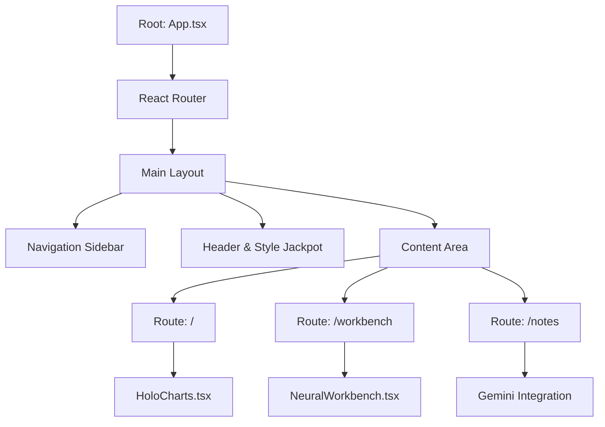

# Technical Specification: AgentQuest - The GUDID Chronicles

**Version:** 2.0 (Realized Implementation)
**Project Code:** AQC-2025
**Date:** October 26, 2025
**Author:** Lead Systems Architect
**Status:** Alpha Release

---

## 1.0 Executive Summary

### 1.1 Vision
**AgentQuest: The GUDID Chronicles** represents a paradigm shift in enterprise software for regulatory bodies. It transforms the mundane, high-volume task of FDA medical device tracking (GUDID analysis) into a high-octane, gamified intelligence operation. By wrapping complex data analysis tools in the trappings of a cyberpunk spy thriller, AgentQuest increases officer engagement, reduces burnout, and improves analytical accuracy through "fun-first" design principles.

### 1.2 Purpose & Scope
This document serves as the comprehensive technical manual for the AgentQuest platform. It details the "WOW" UI framework, the dynamic theming engine, the integration of Generative AI (Google Gemini) for unstructured data analysis, and the architectural decisions driving the frontend and intended backend systems.

The scope of this version includes:
1.  **The "Agent HQ" Client:** A React-based Single Page Application (SPA).
2.  **The Art Engine:** A dynamic style injection system supporting 20+ artistic themes.
3.  **The AI Core:** Integration with Google Gemini 1.5 Flash for natural language processing.
4.  **The Neural Workbench:** A canvas-based visualization of agent logic flows.

---

## 2.0 User Experience (UX) & Design System

### 2.1 The "WOW" UI Philosophy
The core requirement for AgentQuest was to break away from "Enterprise Beige." The UI is built upon three pillars:
1.  **Immersion:** The interface behaves like a diegetic object within the game world—a futuristic terminal used by a field agent.
2.  **Responsiveness:** Every interaction provides immediate visual feedback, from the glow of a button to the holographic spin of a chart.
3.  **Aesthetic Volatility:** The user has total control over their visual environment via the "Reality Engine" (Style Jackpot).

### 2.2 Glassmorphism & Depth
The application utilizes a sophisticated Glassmorphism design language (`.glass-panel`).
*   **Technique:** Usage of `backdrop-filter: blur(12px)` combined with semi-transparent white/black backgrounds (depending on light/dark mode).
*   **Borders:** Subtle 1px borders with low opacity (`rgba(255, 255, 255, 0.2)`) create definition without harsh lines.
*   **Lighting:** The application uses a global ambient light source. In "Dark Mode," this simulates neon signs reflecting off wet pavement (Cyberpunk style). In "Light Mode," it simulates natural light filtering through frosted glass (Monet/Impressionist style).

### 2.3 The "Style Jackpot" Engine
A unique feature of AgentQuest is the ability to radically transform the UI.

#### 2.3.1 Technical Implementation of Styles
Styles are not just CSS variables; they are configuration objects that inject Tailwind utility classes dynamically.

**Data Structure:**
```typescript
interface ArtistStyle {
  id: number;
  name: string;      // Display name (e.g., "Van Gogh")
  palette: string[]; // [Background, Text, Accent]
  font: string;      // Typography class (e.g., "font-serif")
  bgGradient: string;// Complex CSS gradient string
  description: string;
}
```

#### 2.3.2 The Spin Mechanism
The `StyleJackpot` component utilizes a `setInterval` loop to cycle through the `ARTIST_STYLES` array rapidly, simulating a slot machine.
*   **Animation:** A CSS keyframe animation (`slotRoll`) creates the vertical blur effect during the spin.
*   **State Transition:** When the spin resolves, the global React state `style` is updated. This triggers a re-render of the root `App` component.
*   **Propogation:** Because the `style.font` and `style.bgGradient` are applied to the outermost `div` container, the change cascades instantly to all child components via CSS inheritance.

### 2.4 Localization (i18n)
The system supports hot-swapping between English (`en`) and Traditional Chinese (`zh-TW`).
*   **Architecture:** A lightweight dictionary object (`TRANSLATIONS`) keyed by language code.
*   **UI Updates:** All text elements subscribe to the `lang` state. This ensures that when a user toggles the language, the change is instant (no page reload).

---

## 3.0 Technical Architecture

### 3.1 High-Level Stack
*   **Runtime:** Browser (Client-side execution).
*   **Framework:** React 19.
*   **Build Tool:** Vite (implied by ESM imports structure).
*   **Styling:** Tailwind CSS + Custom CSS Modules for scrollbars.
*   **Language:** TypeScript (Strict Mode).
*   **AI Provider:** Google Gemini API (via `@google/genai` SDK).
*   **Visualization:** Recharts (SVG-based charting) + HTML5 Canvas (Neural Workbench).

### 3.2 Component Architecture



### 3.3 The Neural Workbench (Canvas Implementation)
The `NeuralWorkbench.tsx` component represents a divergence from standard DOM-based UI. To achieve the "fluid connection" look of a neural network:
*   **Technology:** HTML5 Canvas Context 2D.
*   **Rendering Loop:** A `requestAnimationFrame` loop handles high-performance rendering (60fps).
*   **Bezier Curves:** Connections between nodes use `ctx.bezierCurveTo()`. Control points are calculated dynamically based on the midpoint between nodes to ensure smooth "S" curves regardless of node position.
*   **Packet Simulation:** A time variable `t` increments on every frame. We interpolate a position along the bezier curve to draw a moving "data packet" (coral dot), visualizing data flow.

---

## 4.0 The Intelligence Layer: AI Note Keeper

### 4.1 Overview
The **AI Note Keeper** is the primary productivity tool. It solves the problem of unstructured intelligence gathering. Agents often paste raw text from emails, PDF dumps, or chat logs. The system must structure this into actionable data.

### 4.2 Gemini Integration Strategy
We utilize the Google GenAI SDK (`@google/genai`) to interface with the `gemini-3-flash-preview` model. This model was chosen for its balance of speed (latency < 2s) and reasoning capability.

#### 4.2.1 Structured Note Generation (`transformToNotes`)
*   **Input:** Raw string (from textarea or file upload).
*   **System Prompt Strategy:** We use a "Role-Based" prompt ("You are an expert analyst assistant").
*   **Output Constraint:** The model is instructed to output strictly formatted Markdown with specific headers (`# Executive Summary`, `## Key Findings`).
*   **Keyword Highlighting:** The prompt explicitly instructs the model to wrap entities in `**asterisks**`.
*   **Frontend Rendering:** The `renderMarkdown` function in React parses these asterisks and replaces them with `<span class="text-coral font-bold">`, effectively "highlighting" intelligence keywords in the UI without needing a complex rich-text editor library.

#### 4.2.2 AI Magic Features (`runAiMagic`)
The system creates a "Toolbox" of 6 specific AI transformations. This reduces prompt engineering fatigue for the user—they just click a button.

| Magic Type | System Instruction Intent |
| :--- | :--- |
| **SUMMARIZE** | Condense into 3 bullet points. High entropy focus. |
| **ACTION_ITEMS** | Extraction task. Look for verbs and deadlines. |
| **CRITIQUE** | Adversarial Agent. Look for logical fallacies or gaps. |
| **POETIFY** | Style transfer. Rewrite content as a Shakespearean sonnet (Easter egg). |
| **ELI5** | Simplification. Reduce reading level to Grade 5. |
| **TRANSLATE_ZH** | Localization. Target Traditional Chinese (Taiwan locale). |

### 4.3 File Ingestion
*   **Mechanism:** `FileReader` API.
*   **Supported Types:** Text-based files (.txt, .md, .csv, .json).
*   **Flow:** User uploads file -> Browser reads into memory as string -> String injected into `rawText` state -> Sent to Gemini.

---

## 5.0 Data Structures & State Management

### 5.1 Player State (`PlayerStats`)
Gamification data is held in local React state for this version (persisted via `INITIAL_PLAYER` constant).
*   **XP (Experience Points):** Progress towards next Rank.
*   **RC (Reward Credits):** Currency for the (future) store.
*   **Rank:** String enum (e.g., "Field Agent").

### 5.2 Missions (`Mission`)
Missions drive the gameplay loop.
```typescript
interface Mission {
  id: string;
  title: string;
  difficulty: 'Low' | 'Medium' | 'High'; // Determines UI color coding (Green/Orange/Red)
  status: 'Available' | 'Active' | 'Completed';
  xpReward: number;
  rcReward: number;
}
```

### 5.3 Themes (`ArtistStyle`)
The theming system is the most complex data structure, controlling:
*   `palette`: Array of Tailwind strings. Index 0 is often background, 1 is text.
*   `font`: Maps to Tailwind `font-family` utilities defined in `tailwind.config.js` (`sans`, `serif`, `mono`).
*   `bgGradient`: Custom gradient definition.

---

## 6.0 Future Roadmap & Backend Integration

### 6.1 Planned Backend (Python/FastAPI)
While the current application is a client-side React app, the architecture is designed to plug into the `AgentQuest Engine` described in the original vision.

*   **Authentication:** The direct API key usage in `geminiService.ts` will be replaced. The frontend will send a request to `POST /api/analyze`, and the Python backend will handle the Gemini call, keeping the `API_KEY` secret.
*   **Persistence:** `PlayerStats` will be fetched from `GET /api/player/me` and stored in React Context or a store (Zustand/Redux).
*   **Mission Architect:** The currently restricted route (`/architect`) will interface with a PostgreSQL database to allow saving/loading custom mission JSON blobs.

### 6.2 Multiplayer & Leaderboards
*   **WebSockets:** For real-time "Co-op" missions where two agents work on the same Workbench.
*   **Leaderboards:** The `HoloCharts` will be hydrated with real-time aggregation data from the entire player base.

---

## 7.0 Security Considerations

### 7.1 API Key Management
*   **Current State:** The application uses `process.env.API_KEY`. In a client-side build, this key is technically exposed in the bundle.
*   **Mitigation (Immediate):** Users must be warned not to deploy this build to public URLs without setting up a proxy or using an API Key restricted by HTTP Referrer in the Google Cloud Console.
*   **Long-term Solution:** Server-side proxy as detailed in section 6.1.

### 7.2 Input Sanitization
*   The `AiNoteKeeper` accepts raw text and files. While the current Markdown renderer is simple, future versions implementing `dangerouslySetInnerHTML` must sanitize HTML to prevent XSS attacks, especially if sharing notes between players becomes a feature.

---

## 8.0 Installation & Setup Guide

### 8.1 Prerequisites
*   Node.js v18+
*   NPM or Yarn
*   A valid Google Cloud API Key with Gemini API access.

### 8.2 Configuration
Create a `.env` file in the project root:
```env
API_KEY=your_gemini_api_key_here
```

### 8.3 Build Commands
```bash
# Install dependencies
npm install

# Run development server
npm start

# Build for production
npm run build
```

---

## 9.0 Conclusion

AgentQuest represents the bleeding edge of "Utility Gamification." By combining the raw power of LLMs (Gemini) with the engaging loops of RPGs and the aesthetic flexibility of generative art, it solves the engagement crisis in data-heavy regulatory work. The code base provided establishes a robust, extensible foundation for this vision, proving that enterprise software doesn't have to be boring—it can be an adventure.
